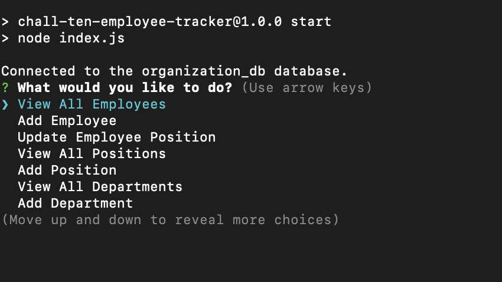

# Challenge Ten: SQL - Employee Tracker

## Project Description

Challenge Ten required us to build a Command Line Application that utilizes Node.js to manage an organization's employee database.  the starter code so that the Note Taker application can write and save a user's notes. This employee tracker uses Inquirer to feed the user prompts and handle their responses. The application then uses user responses it received from Inquirer to store, retrieve, and manipulate data in a database using MySQL. 

## Application Menu

The following image shows the application after start up with various options and is not exited until the user selects 'Quit'.

### Demo

The following video links to a demo of the Employee Tracker.

[Google Drive Demo Link](https://drive.google.com/file/d/17rr-YWt_T_o8wc-N4u7KUcM--z8BFy3x/view)

### Link to Github Repository
[https://github.com/jffsun/chall-ten-employee-tracker](https://github.com/jffsun/chall-ten-employee-tracker)